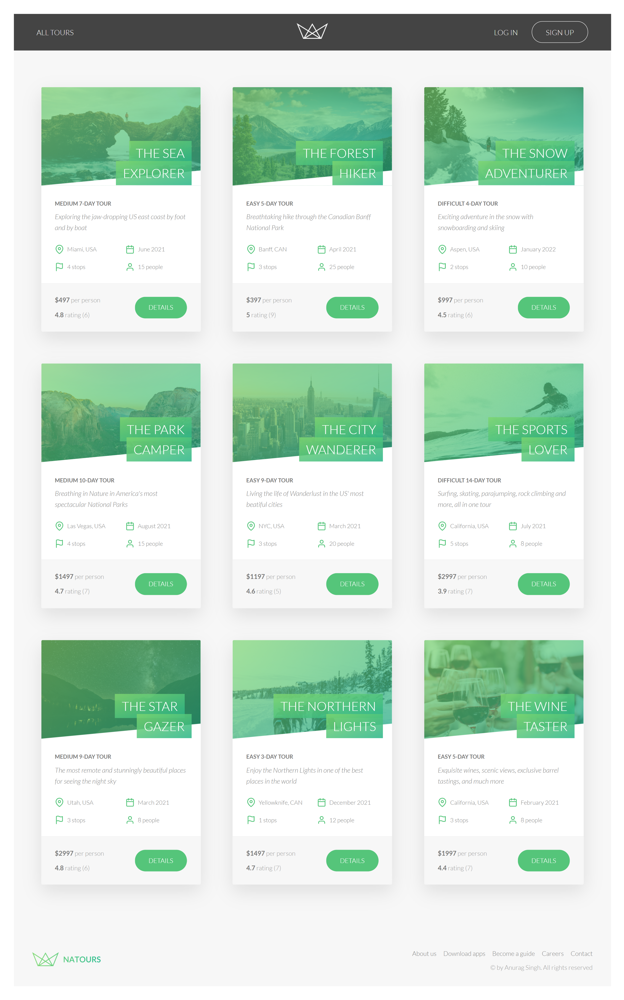
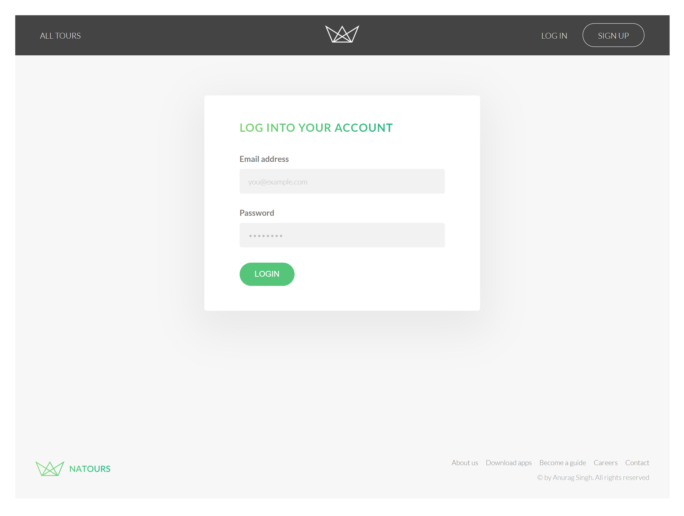
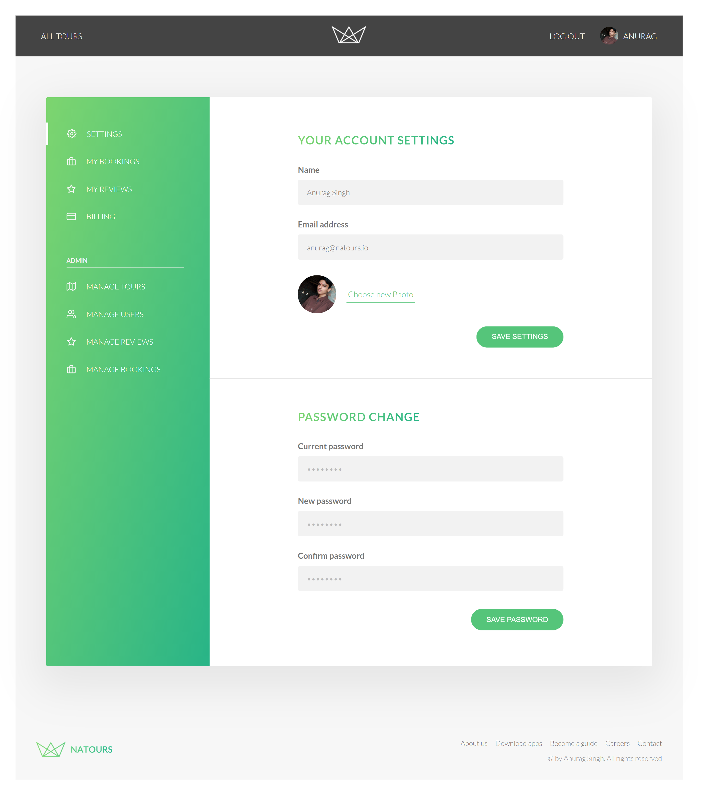
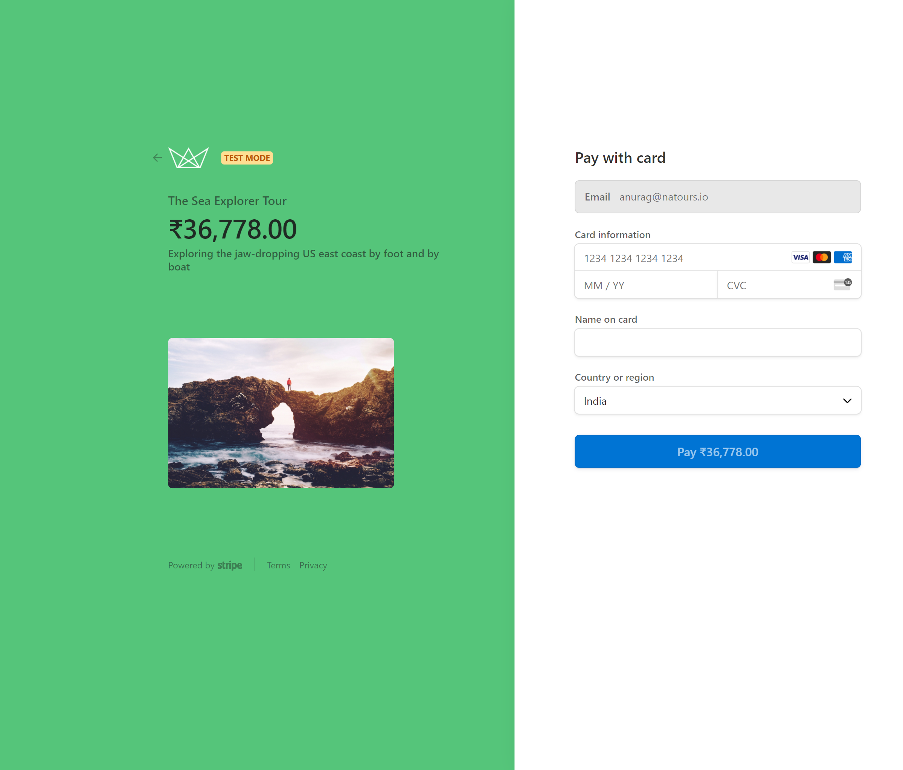

# Natours web app

### This is how the web app looks like currently

##### Home Page

##### Details Page

##### Login Page

##### CMS-admin Page

##### Stripe-checkout

## Note

Before starting the server kindly create a config.env file.
